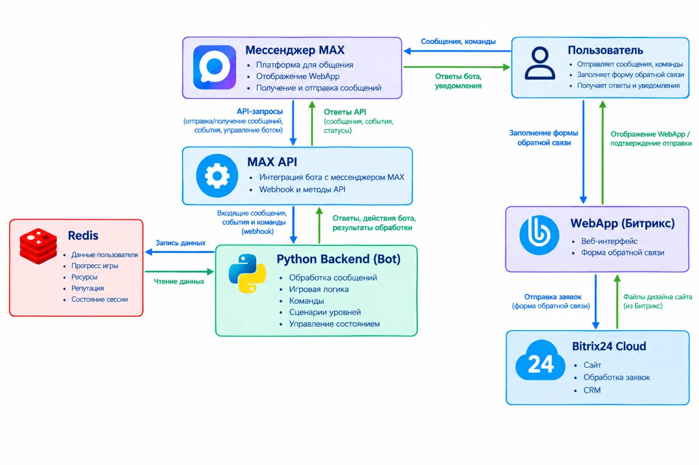

# 🌊 Процесс 1 — образовательный игровой бот для мессенджера MAX

Процесс 1 — интерактивный образовательный бот, разработанный на Python с использованием MAX API.

Проект предназначен для начинающих аналитиков и менеджеров, помогая изучать основы управления процессами, анализа данных и принятия управленческих решений в интерактивном формате.

Проект объединяет обучение и игровой формат: пользователь изучает учебные материалы, проходит сюжетные главы, принимает решения и проверяет свои знания через игровые сценарии.

В процессе прохождения пользователь развивает навыки анализа ситуаций, управления ресурсами и оценки последствий принятых решений, приближаясь к реальным задачам менеджмента и бизнес-аналитики.

## 🚀 Возможности проекта

- 🤖 Интеграция с мессенджером MAX через MAX API
- 🎮 Сюжетная система с игровыми уровнями и выборами пользователя
- 📚 Раздел учебных материалов и лекций
- 📊 Система ресурсов игрока:
  - бюджет;
  - энергия;
  - продовольствие
- ⚖️ Система репутации с игровыми фракциями
- 💾 Хранение состояния пользователя
- 🖼️ Оптимизированная отправка медиа через систему кэширования MAX API
- 🎁 Поддержка стикеров и интерактивных элементов
- 🔘 Динамические клавиатуры
- 📝 Логирование действий пользователей

## 🏗 Архитектура проекта

Проект построен по модульной архитектуре:

- **MAX Messenger** — пользовательский интерфейс взаимодействия;
- **MAX API** — слой связи между ботом и мессенджером;
- **Python Backend** — обработка сообщений, игровая логика и управление состоянием;
- **Redis** — хранение данных пользователей и прогресса;
- **WebApp Bitrix24** — веб-интерфейс и форма обратной связи.

## 🛠 Используемые технологии

- Python 3.14
- MAX API
- Redis
- Pydantic Settings
- Loguru
- Asyncio
- Bitrix24 WebApp

## 📂 Файловая архитектура проекта

| Путь | Тип | Назначение |
| :--- | :---: | :--- |
| `/` | Папка проекта | Корневая директория проекта MAXwater |
| `main.py` | Файл | Главная точка запуска приложения, инициализация MAX Bot и подключение компонентов |
| `config.py` | Файл | Конфигурация проекта, загрузка настроек и переменных окружения |
| `logger.py` | Файл | Настройка системы логирования приложения |
| `.env` | Файл | Хранение секретных параметров: токены, настройки окружения |
| `requirements.txt` | Файл | Список зависимостей Python проекта |
| `media_cache.json` | Файл | Локальное хранилище кэша медиафайлов MAX API |
| `/functions` | Папка | Вспомогательные модули и бизнес-логика |
| `functions/base_keyboard_maker.py` | Файл | Создание inline-клавиатур MAX API |
| `functions/ch1_bad_end.py` | Файл | Проверка условий плохих концовок первой главы |
| `functions/edit_resources.py` | Файл | Изменение игровых ресурсов пользователя |
| `functions/maxapi_patch.py` | Файл | Расширение стандартного метода отправки сообщений MAX API |
| `functions/name_validation.py` | Файл | Проверка корректности имени пользователя |
| `functions/remove_keyboards.py` | Файл | Управление удалением клавиатур сообщений |
| `functions/reputation.py` | Файл | Расчёт и отображение репутации фракций |
| `functions/resources_print.py` | Файл | Формирование информации о ресурсах игрока |
| `functions/send_sticker.py` | Файл | Создание и отправка стикеров через MAX API |
| `functions/smart_answer_func.py` | Файл | Умная отправка сообщений с использованием Media Cache |
| `/handlers` | Папка | Обработчики событий и команд бота |
| `handlers/menu.py` | Файл | Главное меню и навигация пользователя |
| `handlers/introduction.py` | Файл | Вступительный сценарий игры |
| `handlers/chapter1.py` | Файл | Логика прохождения первой главы |
| `handlers/last_stand.py` | Файл | Обработка неизвестных сообщений |
| `/keyboards` | Папка | Хранилище клавиатур интерфейса |
| `keyboards/menu_kb.py` | Файл | Кнопки главного меню |
| `/states` | Папка | Управление состояниями пользователя |
| `states/menu_states.py` | Файл | Состояния меню |
| `states/chapter1_states.py` | Файл | Состояния первой главы |
| `/middlewares` | Папка | Промежуточная обработка событий |
| `middlewares/logger_middleware.py` | Файл | Логирование действий пользователей |
| `/media` | Папка | Медиафайлы проекта |
| `media/menu` | Папка | Изображения меню |
| `media/library` | Папка | Учебные материалы и лекции |
| `media/chapter1` | Папка | Изображения первой главы |
| `/logs` | Папка | Файлы журналов системы |
| `logs/bot.log` | Файл | Основной журнал работы бота |
| `logs/errors.log` | Файл | Журнал ошибок приложения |

## 🗄 Структура хранения данных Redis

Для хранения состояния пользователя и игрового прогресса используется Redis.

Redis содержит данные о профиле игрока, ресурсах станции, прохождении сюжетных линий и репутации среди игровых фракций.

| Ключ Redis | Тип | Пример значения | Назначение |
| :---: | :---: | :---: | :--- |
| `last_message` | Object | `SendedMessage(...)` | Последнее отправленное сообщение игроку. Используется для редактирования сообщений и управления клавиатурами |
| `last_media` | Object | `InputMedia(...)` | Последнее медиа, отправленное игроку |
| `name` | String | `Данил` | Имя игрока, ограниченное длиной до 20 символов |
| `briefing` | Integer | `0-1` | Флаг прохождения вступительного брифинга |
| `finance` | Integer | `0-20` | Текущий уровень бюджета игрока |
| `energy` | Integer | `0-10` | Текущий уровень энергии станции |
| `food` | Integer | `0-10` | Количество запасов еды |
| `odyssey` | Integer | `0-1` | Прогресс или флаг сюжетной линии «Одиссея» |
| `trees` | Integer | `0-1` | Состояние сюжетного выбора, связанного с деревьями |
| `radar` | Integer | `1-3` | Состояние радара или модуля станции |
| `food_update` | Integer | `0-1` | Флаг события или обновления, связанного с запасами еды |
| `ch1_scientist` | Integer | `-1...1` | Репутация с учёными в первой главе |
| `ch1_security` | Integer | `-1...1` | Репутация с охраной в первой главе |
| `ch1_worker` | Integer | `-1...1` | Репутация с рабочими в первой главе |

